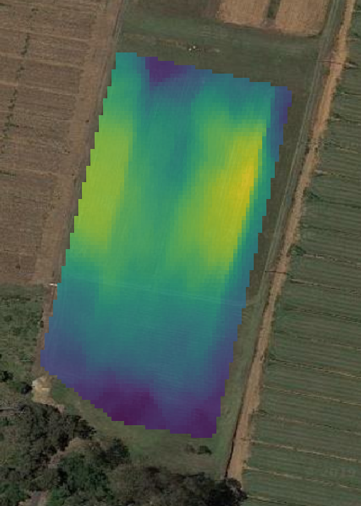

# OpenEM Data
The contents of this repository include the data and analysis for the [OpenEM](https://github.com/KipCrossing/OpenEM) project. The data may include:
[discord.py](https://pypi.org/project/discord.py/)
* OpenEM readings + GPS
* Dualem reading + GPS
* EM38 readings + GPS
* Soil samples + GPS

Analysis of these data are done via the included python scripts and maps are produces in QGIS.

Below are some maps that compare the readings taken with the  OpenEM and DualEM

## OpenEM

## DualEM

